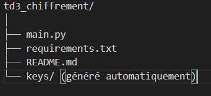
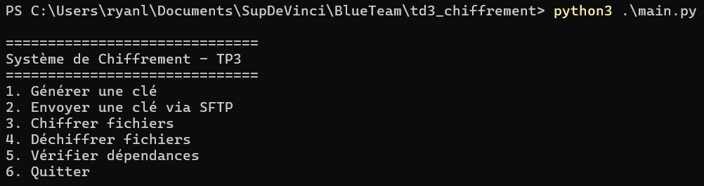
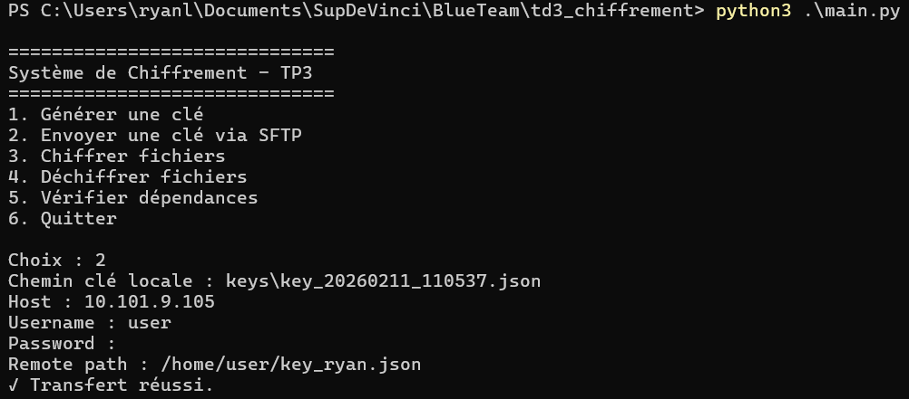
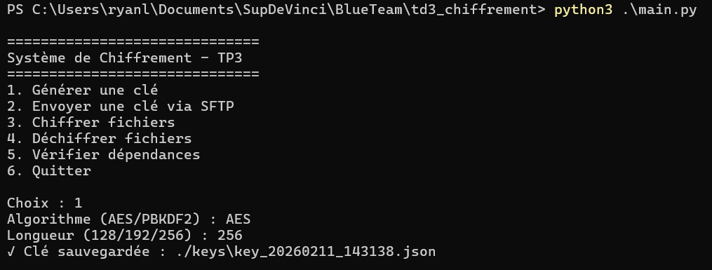
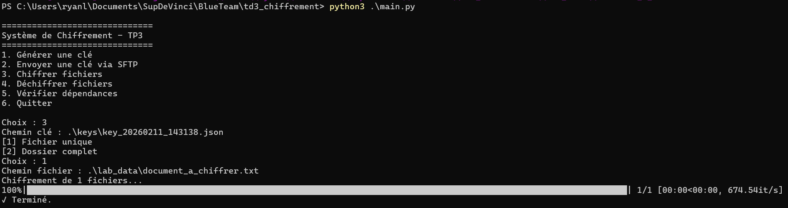
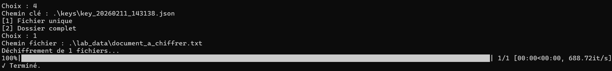
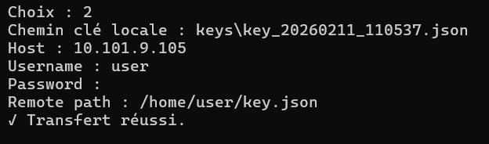

# 🔐 TD3 – Système de Chiffrement (Projet Cybersécurité)

## 🎓 Contexte

Ce projet a été réalisé dans le cadre du module de cybersécurité (Blue Team).

L’objectif est de développer un système de gestion de clés et de chiffrement de fichiers en Python, intégrant :

- Vérification des dépendances
- Génération sécurisée de clés (AES / PBKDF2)
- Stockage local sécurisé des clés
- Transfert sécurisé via SFTP
- Chiffrement et déchiffrement de fichiers/dossiers
- Interface menu interactive

⚠️ Projet pédagogique réalisé en environnement de laboratoire.

---

## 🗂️ Structure du Projet




---

## ⚙️ Prérequis

- Python 3.8+
- pip
- Serveur Ubuntu avec SSH actif (pour le SFTP)

---

## 📦 Installation

Cloner le projet puis installer les dépendances :

```bash
pip install -r requirements.txt
```
---

## ▶️ Lancement du programme
```bash
python main.py
```
Menu principal :


---

## 🔑 Fonctionnalités

### 1️⃣ Vérification des dépendances

* Vérifie Python ≥ 3.8

* Vérifie la présence de :
    * cryptography
    * paramiko

* Installation automatique si manquantes

### 2️⃣ Génération de clé

Deux modes disponibles :

🔹 AES

* Génération aléatoire via secrets.token_bytes

* Longueurs : 128 / 192 / 256 bits

🔹 PBKDF2

* Dérivation à partir d’un mot de passe

* Salt aléatoire

* 390 000 itérations

* SHA-256

Les clés sont sauvegardées dans :
```bash
./keys/
```
Format JSON :
```bash
{
  "key": "base64..."
}
```
Permissions restreintes (chmod 600).

### 3️⃣ Transfert SFTP

Utilisation de la bibliothèque **paramiko.**

Connexion sécurisée via SSH :


Transfert réalisé via :
```python
paramiko.Transport
paramiko.SFTPClient
```

### 4️⃣ Chiffrement de fichiers

* Algorithme : AES-CBC
* IV aléatoire (16 bytes)
* Padding PKCS7
* Écriture in-place (remplacement du fichier)
* Barre de progression via tqdm

Fonction :
```python
encrypt_file(filepath, key)
```
Le fichier final contient :
```bash
IV + ciphertext
```

### 5️⃣ Déchiffrement de fichiers

* Lecture des 16 premiers bytes (IV)
* Déchiffrement AES-CBC
* Suppression du padding PKCS7
* Gestion d’erreur si mauvaise clé

Fonction :
```python
decrypt_file(filepath, key)
```

---

## 🛡️ Sécurité Implémentée
* Génération de clés cryptographiquement sécurisée
* Mot de passe non stocké
* Permissions restreintes des clés
* IV aléatoire par fichier
* Gestion d’erreurs propre (try/except)
* Authentification SSH sécurisée

---

## 🧪 Exemple d’utilisation

Génération d’une clé AES 256 :



Chiffrement d’un fichier :



Déchiffrement d'un fichier :



🖥️ Test SFTP avec Ubuntu :



--- 

## 📚 Bibliothèques utilisées
* cryptography
* paramiko
* tqdm
* secrets
* json
* os
* subprocess
